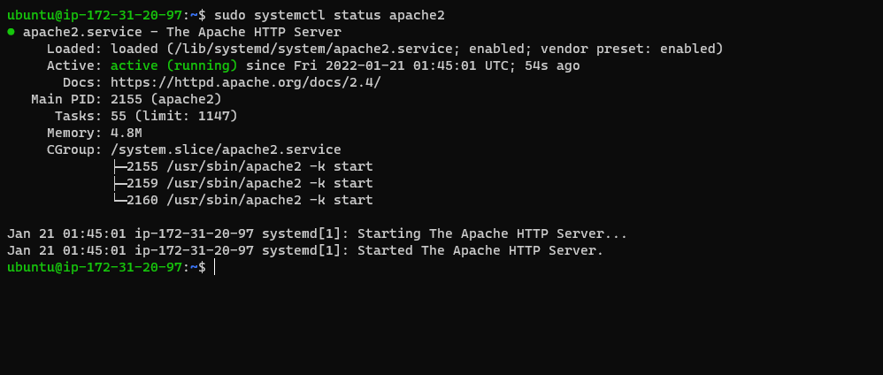

## Awesome Documentation of project 1

`sudo apt update`

`sudo apt install apache2`

`sudo systemctl apache2`

- [Install oppenssh](https://docs.microsoft.com/en-us/windows-server/administration/openssh/openssh_install_firstuse)

- [openssh-key management](https://docs.microsoft.com/en-us/windows-server/administration/openssh/openssh_keymanagement)

- [markdown cheat sheet](https://www.markdownguide.org/cheat-sheet/)